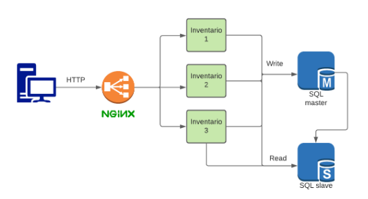

# nginx-loadbalancer-postgresql

## Descripción de la tarea

Implementación de un balanceador de carga con Nginx y replicas de base de datos PostgreSQL, para un microservicio de inventario.

<p align="center">
 
</p>

## Configuración de la base de datos


Para hacer las replicas de forma mas sencilla se utilizó **Docker** y los siguientes comandos para instalar ambas versiones del servidor.

```bash
# servidor master
docker run -dti -p 55432:5432 --name postgresql-master \
  -e POSTGRESQL_REPLICATION_MODE=master \
  -e POSTGRESQL_USERNAME=zuka \
  -e POSTGRESQL_PASSWORD=zukaritas \
  -e POSTGRESQL_DATABASE=my_database \
  -e POSTGRESQL_REPLICATION_USER=zukas \
  -e POSTGRESQL_REPLICATION_PASSWORD=zucaritas \
  bitnami/postgresql:latest
# servidor slave
docker run -dti -p 65432:5432 --name postgresql-slave \
  --link postgresql-master:master \
  -e POSTGRESQL_REPLICATION_MODE=slave \
  -e POSTGRESQL_USERNAME=zuka \
  -e POSTGRESQL_PASSWORD=zukaritas \
  -e POSTGRESQL_MASTER_HOST=master \
  -e POSTGRESQL_MASTER_PORT_NUMBER=5432 \
  -e POSTGRESQL_REPLICATION_USER=zukas \
  -e POSTGRESQL_REPLICATION_PASSWORD=zucaritas \
  bitnami/postgresql:latest
```

A continuación hay una explicación de la configuración de las bases de datos.

### Puertos
De forma interna en los contenedores, todas las replizas utilizan el puerto `5432` para PostgreSQL, dentro de la maquina se tienen los siguientes puertos:
* **Master**: Puerto 55432
* **Slave**: Puerto 65432

### Usuarios
Las credenciales de los usuarios son las siguientes:

* **Master**: 
  * Usuario: zuka
  * Contraseña: zukaritas
* **Slave**:
  *  Usuario: zukas
  * Contraseña: zucaritas

### Tablas
Para la creacion de la tabla que almacene los productos se utilizo el siguiente comando.
```sql
CREATE TABLE IF NOT EXISTS producto (
    id serial PRIMARY KEY,
    nombre VARCHAR(255) UNIQUE NOT NULL,
    codigo VARCHAR(65) UNIQUE NOT NULL,
    precio DECIMAL(11,2) NOT NULL
)
```

# Configuración de microservicios


## Flask Python

### Dependencias

 Las dependencias necesarias para que se pueda ejecutar el programa se encuentran en el archivo `requirements.txt`.

### Ejecucion
Para comenzar la ejecucion de los servidores se utilizaron los siguientes comandos en el terminal, ubicandonos en la carpeta principal

```flask 
export FLASK_APP=./microservices/src/flask_app.py
flask run -h localhost -p 5000
flask run -h localhost -p 5001
flask run -h localhost -p 5002 
```

### Metodos HTTP
Para realizar las acciones en el servidor se crearon 2 metodos, AddProduct y GetProduct.

A continuacion se adjuntan las direcciones y ejemplos de request para cada uno.

* AddProduct 
  * Dominio: localhost/AddProduct
  * Request de ejemplo:

  ```json
    {
      "nombre":"ejemplo",
      "codigo":"TEST01",
      "precio": 500000.6
    }
  ```
* GetProduct 
  * Dominio: localhost/GetProduct?q=
  * Para este metodo se debe agregar la palabra a buscar luego de *?q=*, por ejemplo **?q=aaa**
  


# Configuración de Nginx

Como configuracion para el balanceador de carga se utilizo el archivo que se ve a continuacion y ubicado en la carpeta `nginx`. Se utilizo el metodo de balanceo round robin y se asigna la direccion de los servidores de replica.
```nginx
upstream flask_servers {
    # Default Round-Robin
    # Flask localhost
    server 127.0.0.1:5000;
    server 127.0.0.1:5001;
    server 127.0.0.1:5002;
}

server {
    # Puerto 
    listen 80;
    location / {
        proxy_pass http://flask_servers;
    }
}
```

